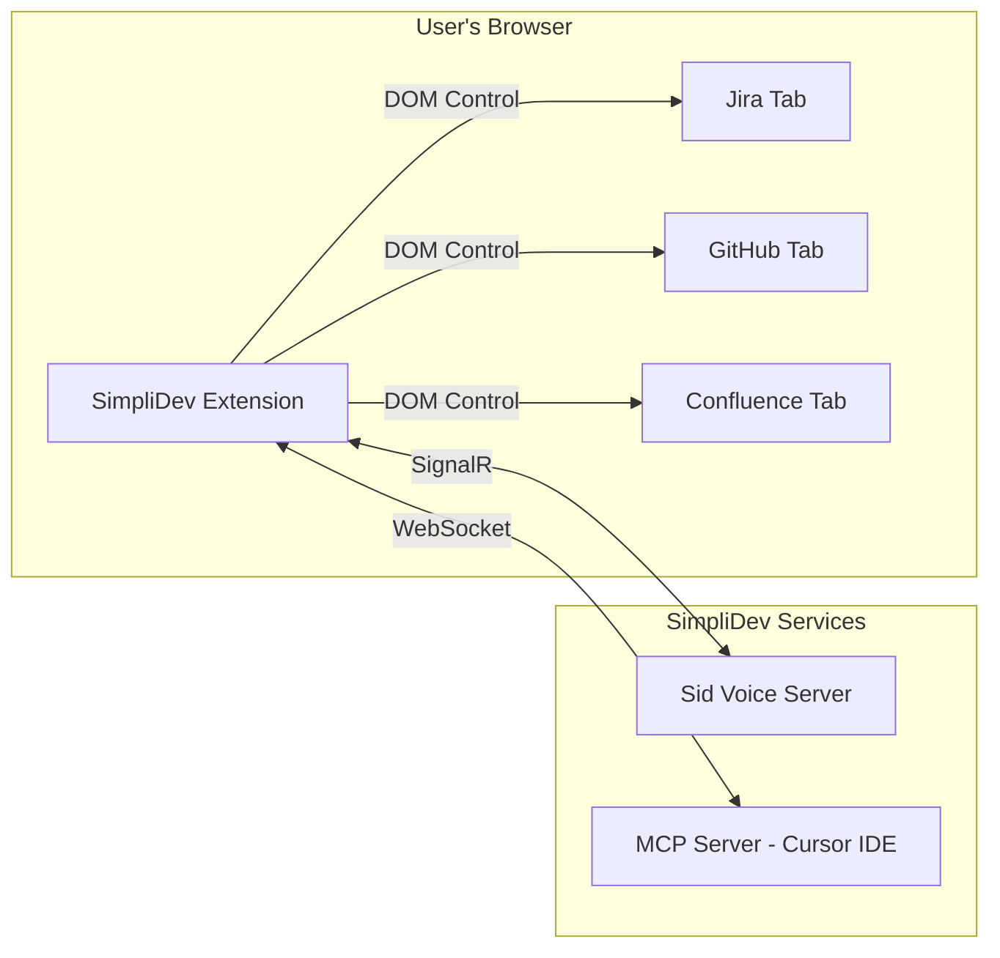

# SimpliDev Browser Extension

Chrome/Edge extension that enables Sid Voice to control your browser via voice commands.

## Overview

This extension connects your browser to Sid Voice, allowing voice-controlled navigation and interaction with Jira, GitHub, Confluence, and other web apps using your existing authenticated sessions.

## Architecture



## Features

- **Voice-controlled browsing**: "Show me SID-262" navigates to Jira tickets
- **Remote browser control**: Sid Voice sends commands via SignalR
- **Works with existing sessions**: Uses your logged-in state (no re-auth needed)
- **MCP compatibility**: Also works with Cursor IDE's Playwright MCP

## Quick Start

### 1. Build the Extension

```bash
npm install
npm run build
```

### 2. Load in Chrome/Edge

1. Navigate to `chrome://extensions/` or `edge://extensions/`
2. Enable **Developer mode** (toggle in top right)
3. Click **Load unpacked** and select the `dist` directory

### 3. Connect to Sid Voice

1. Click the SimpliDev extension icon
2. Enter your SimpliGov email
3. Click **Connect to Sid Voice**

## Voice Commands

| Command                            | Action                            |
| ---------------------------------- | --------------------------------- |
| "Show me SID-262"                  | Opens Jira ticket                 |
| "Open the linked PR"               | Navigates to PR from ticket       |
| "Click Approve"                    | Clicks the Approve button         |
| "Fill in the description: LGTM"    | Types into a field                |
| "Go back"                          | Browser back                      |
| "Refresh"                          | Refreshes the page                |

## Development

```bash
# Build and watch for changes
npm run watch

# Run Playwright tests
npm test

# Clean build
npm run clean

# Package for distribution
npm run package
```

## Files

| File                     | Purpose                                   |
| ------------------------ | ----------------------------------------- |
| `src/background.ts`      | Service worker, connection management     |
| `src/relayConnection.ts` | Playwright MCP WebSocket relay            |
| `src/sidVoiceConnection.ts` | Sid Voice SignalR connection           |
| `src/ui/connect.tsx`     | Connection popup UI                       |
| `src/ui/status.tsx`      | Status popup showing active tabs          |
| `manifest.json`          | Chrome extension manifest (v3)            |

## MCP Mode (for Cursor IDE)

This extension also works with Playwright MCP:

```json
{
  "mcpServers": {
    "playwright-extension": {
      "command": "npx",
      "args": ["@playwright/mcp@latest", "--extension"]
    }
  }
}
```

## Packaging for Release

```bash
# Build, zip, and copy to SimpliDev templates
npm run package:release
```

This creates `simplidev-browser-extension.zip` and copies it to the SimpliDev resources folder for distribution.

## Related

- [SimpliDev](https://github.com/SimpliGov/simplidev) - Main project
- [Sid Voice](https://github.com/SimpliGov/simplidev/tree/main/packages/voice-web) - Voice interface
- [Playwright MCP](https://github.com/microsoft/playwright-mcp) - Original fork source

## License

Apache-2.0 (forked from Microsoft Playwright MCP)
